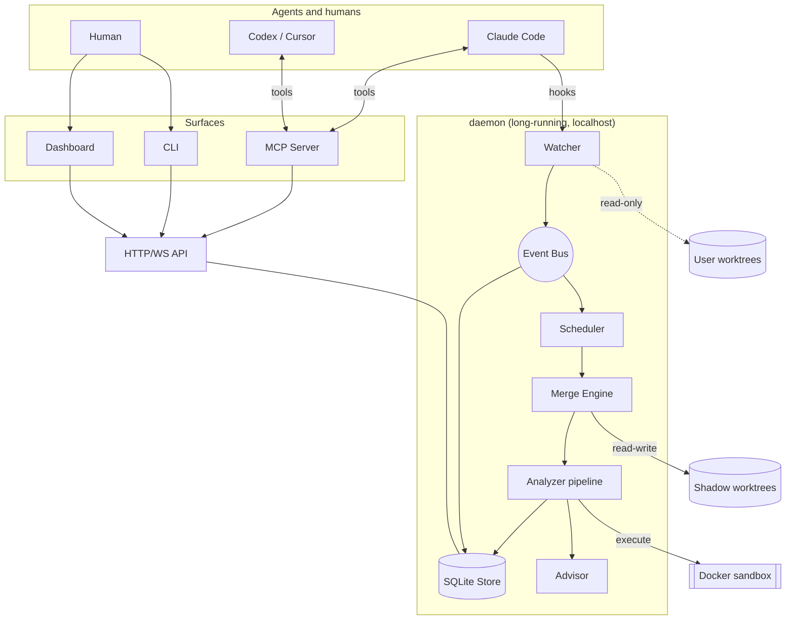

# Architecture

> Structural changes update this file in the same PR.

## The shape of the system

Two edges carry the security posture: the dotted edge to user worktrees is read-only, and everything executed runs inside the sandbox.

## Package map

| Package                 | Role                                                  | Depends on                      |
| ----------------------- | ----------------------------------------------------- | ------------------------------- |
| `@interlock/shared`     | models, events, config, errors, logging, ids          | nothing                         |
| `@interlock/core`       | git/shadow ops, speculative merge, analyzers, ranking | shared                          |
| `@interlock/daemon`     | watcher, bus, scheduler, store, API, composition root | shared, core                    |
| `@interlock/mcp-server` | agent-facing tools                                    | shared (+ daemon API over HTTP) |
| `@interlock/cli`        | `interlock` command                                   | shared (+ daemon API over HTTP) |
| `@interlock/dashboard`  | React UI                                              | shared (+ daemon API over HTTP) |

Dependencies point one way. `shared` imports no sibling; `core` never imports a runtime package. Both are enforced in `eslint.config.js`.

## Lifecycle of a Finding

The path to trace when debugging anything:

1. **Edit.** An agent writes to a file in a worktree.
2. **Observe.** The watcher sees the filesystem event, debounces, publishes `worktree.changed`.
3. **Snapshot.** The dirty tree is captured without touching the user's index — a temporary index file plus `write-tree`, writing objects only. Publishes `changeset.computed`.
4. **Schedule.** Every pair containing this branch is marked stale, superseded runs are aborted, priority is computed (file overlap → symbol overlap → live sessions), work is admitted up to the concurrency limit. Publishes `pair.scheduled`.
5. **Merge.** Both sides' commits — real or snapshot — are merged with `git merge-tree` inside the shadow clone's object database. No checkout, no working directory. Publishes `run.merge-completed`.
6. **Analyze.** A conflicted merge is already a textual finding. A clean merge is a semantic candidate: the pre-filter asks whether the two branches touched overlapping exported symbols, and only then is the merged tree materialised — into the pair's slot in a small pool of persistent worktrees, updated by delta so incremental compiler state survives between checks — and handed to the compiler, the build and targeted tests inside the sandbox. Each step publishes `run.analyzer-completed`.
7. **Attribute.** Each problem is traced to which side introduced which half — the difference between "TS2304" and "your rename broke a call site the other branch added".
8. **Record.** Findings are persisted with evidence: spans on both branches, each in that branch's own file; for a textual conflict, the merge it came from — both commits, the merge base and git's conflict type; redacted tool output; symbol trails. Publishes `finding.raised`.
9. **Advise.** The advisor ranks by severity × confidence and produces Advice within the noise budget.
10. **Deliver.** MCP pushes to the owning agent, rate-limited; the dashboard updates over WebSocket; `interlock status` shows it. Publishes `advice.delivered`.
11. **Invalidate.** Branches move; the finding becomes `stale`, is re-verified, and ends `resolved` or `dismissed`.

Every step publishes an event with a `causedBy` pointer, so a Finding can be walked back to the edit that caused it.

## Where the hard parts live

| Problem                                                    | Lives in                          | Notes                                                  |
| ---------------------------------------------------------- | --------------------------------- | ------------------------------------------------------ |
| Not melting the CPU with N² pairs                          | `daemon/src/scheduler`            | `notes.md` — debounce, priority, invalidation, budgets |
| Snapshotting dirty state without touching the user's index | `core/src/git/worktree.ts`        | temporary index file; objects only                     |
| Disk cost of shadow worktrees                              | `core/src/git/shadow.ts`          | one clone per repo, shared objects, quota + GC         |
| Materialising merged trees cheaply                         | `core/src/git/worktree-pool.ts`   | LRU per-pair slots, `reset --hard` rewrites the delta  |
| Telling merge-induced errors from pre-existing ones        | `core/src/analyzers`              | baseline diff across base, both branches and the merge |
| Naming which branch broke which half                       | `core/src/analyzers`              | attribution against both ChangeSets                    |
| Not being ignored by agents                                | `mcp-server` + `core/src/advisor` | ranking + rate limits                                  |
| Not being an attack surface                                | `mcp-server/src/sanitize.ts`      | untrusted content wrapped as data                      |

## Data flow invariants

- Models are JSON-serializable and identical across SQLite rows, HTTP responses and MCP payloads.
- The event log is append-only; there is no update or delete path for events.
- Analyzer results are cached on `(snapshotA, snapshotB, analyzer, toolchain fingerprint)`; a lockfile change invalidates the cache.
- Infra failures (`SANDBOX_UNAVAILABLE`, `TOOLCHAIN_UNSUPPORTED`) are never findings.
