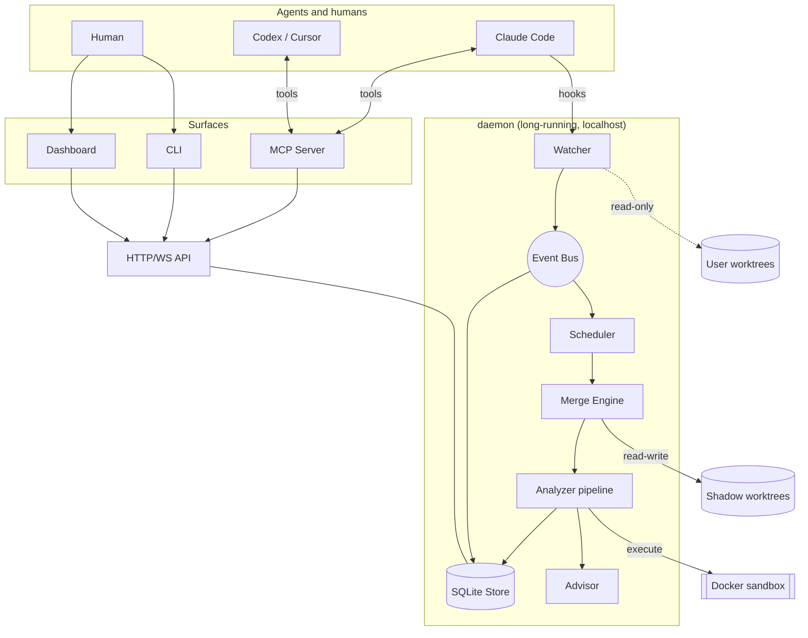

# Architecture

> Structural changes update this file in the same PR.

## The shape of the system

```mermaid
flowchart TB
    subgraph agents[Agents and humans]
        CC[Claude Code]
        CX[Codex / Cursor]
        H[Human]
    end

    subgraph daemon["daemon (long-running, localhost)"]
        W[Watcher] --> B((Event Bus))
        B --> S[Scheduler]
        S --> ME[Merge Engine]
        ME --> AN[Analyzer pipeline]
        AN --> ST[(SQLite Store)]
        B --> ST
        AN --> ADV[Advisor]
    end

    subgraph surfaces[Surfaces]
        MCP[MCP Server]
        CLI[CLI]
        DASH[Dashboard]
    end

    CC -->|hooks| W
    CC <-->|tools| MCP
    CX <-->|tools| MCP
    H --> CLI
    H --> DASH

    MCP --> API[HTTP/WS API]
    CLI --> API
    DASH --> API
    API --- ST

    W -.->|read-only| REPO[(User worktrees)]
    ME -->|read-write| SHADOW[(Shadow worktrees)]
    AN -->|execute| BOX[[Docker sandbox]]
```

Two edges carry the security posture: the dotted edge to user worktrees is read-only, and everything executed runs inside the sandbox.

## Package map

| Package                 | Role                                                  | Depends on                      |
| ----------------------- | ----------------------------------------------------- | ------------------------------- |
| `@interlock/shared`     | models, events, config, errors, logging, ids          | nothing                         |
| `@interlock/core`       | git/shadow ops, speculative merge, analyzers, ranking | shared                          |
| `@interlock/daemon`     | watcher, bus, scheduler, store, API, composition root | shared, core                    |
| `@interlock/mcp-server` | agent-facing tools                                    | shared (+ daemon API over HTTP) |
| `@interlock/cli`        | `interlock` command                                   | shared (+ daemon API over HTTP) |
| `@interlock/dashboard`  | React UI                                              | shared (+ daemon API over HTTP) |

Dependencies point one way. `shared` imports no sibling; `core` never imports a runtime package. Both are enforced in `eslint.config.js`.

## Lifecycle of a Finding

The path to trace when debugging anything:

1. **Edit.** An agent writes to a file in a worktree.
2. **Observe.** The watcher sees the filesystem event, debounces, publishes `worktree.changed`.
3. **Snapshot.** The dirty tree is captured without touching the user's index — a temporary index file plus `write-tree` — and its objects are written into the shadow clone's store, never the user's. Publishes `branch.snapshot`, naming the tree and the head it was captured against.
4. **Schedule.** Once the branch has been quiet for the debounce, or at a ceiling if it never is, every pair containing it is marked stale and runs in flight for those pairs are told to discard their results. Pairs whose changes have nothing in common are never merged; the rest are ranked by file overlap and admitted up to the concurrency limit, and a pair already analysed at the same content is not merged again. Publishes `pair.scheduled`.
5. **Merge.** Both sides' commits — real or snapshot — are merged with `git merge-tree` inside the shadow clone's object database. No checkout, no working directory. Publishes `run.merge-completed`.
6. **Analyze.** A conflicted merge is already a textual finding. A clean merge is a semantic candidate: the pre-filter asks whether the two branches touched overlapping exported symbols, and only then is the merged tree materialised — into the pair's slot in a small pool of persistent worktrees, updated by delta so incremental compiler state survives between checks — and handed to the compiler, the build and targeted tests inside the sandbox. Each step publishes `run.analyzer-completed`.
7. **Attribute.** Each problem is traced to which side introduced which half — the difference between "TS2304" and "your rename broke a call site the other branch added".
8. **Record.** Findings are persisted with evidence: spans on both branches, each in that branch's own file; for a textual conflict, the merge it came from — both commits, the merge base and git's conflict type; redacted tool output; symbol trails. Publishes `finding.raised`.
9. **Advise.** The advisor ranks by severity × confidence and produces Advice within the noise budget.
10. **Deliver.** MCP pushes to the owning agent, rate-limited; the dashboard updates over WebSocket; `interlock status` shows it. Publishes `advice.delivered`.
11. **Invalidate.** Branches move; the pair is re-verified, and a finding the next run does not reproduce ends `resolved`.

Every step publishes an event with a `causedBy` pointer, so a Finding can be walked back to the edit that caused it.

`interlock check` runs this path on demand for one named pair, through the daemon, which is the only writer of the shadows and the store. `POST /api/repos/:id/check` runs a watcher pass over the repository first, so the pair is judged on what is on disk now and a branch made a moment ago can be named; plans the pair whatever its overlap; queues it ahead of everything else, past any backoff; and waits for the run launched from that request, up to a deadline the caller sets, asking again if a side moves under it. It answers with the pair's open Findings read from the store, not with what the run did: a run that merges nothing because the content was already judged is still an answer. It is the API's second write route, beside the session hook, and takes the same token.

## Where the hard parts live

| Problem                                                    | Lives in                          | Notes                                                  |
| ---------------------------------------------------------- | --------------------------------- | ------------------------------------------------------ |
| Not melting the CPU with N² pairs                          | `daemon/src/scheduler`            | `notes.md` — debounce, priority, invalidation, budgets |
| Snapshotting dirty state without touching the user's index | `core/src/git/worktree.ts`        | temporary index file; objects only                     |
| Disk cost of shadow worktrees                              | `core/src/git/shadow.ts`          | one clone per repo, shared objects, quota + GC         |
| Materialising merged trees cheaply                         | `core/src/git/worktree-pool.ts`   | LRU per-pair slots, `reset --hard` rewrites the delta  |
| Telling merge-induced errors from pre-existing ones        | `core/src/analyzers`              | baseline diff across base, both branches and the merge |
| Naming which branch broke which half                       | `core/src/analyzers`              | attribution against both ChangeSets                    |
| Not being ignored by agents                                | `mcp-server` + `core/src/advisor` | ranking + rate limits                                  |
| Not being an attack surface                                | `mcp-server/src/sanitize.ts`      | untrusted content wrapped as data                      |

## Data flow invariants

- Models are JSON-serializable and identical across SQLite rows, HTTP responses and MCP payloads.
- The event log is append-only; there is no update or delete path for events.
- Analyzer verdicts are cached on the content they judged: the pair in its own order, each side's tree, the merge base, the shadow clone it was merged in, and the analyzer's fingerprint — its own version, the version of every tool it ran through, and the build of the code that merged, classified and redacted. Any change to content, a lockfile included, is another key, and a changed analyzer or toolchain is a miss. Verdicts that describe the environment rather than the content — an infrastructure failure, a timeout — are never cached.
- Infra failures (`SANDBOX_UNAVAILABLE`, `TOOLCHAIN_UNSUPPORTED`) are never findings.
